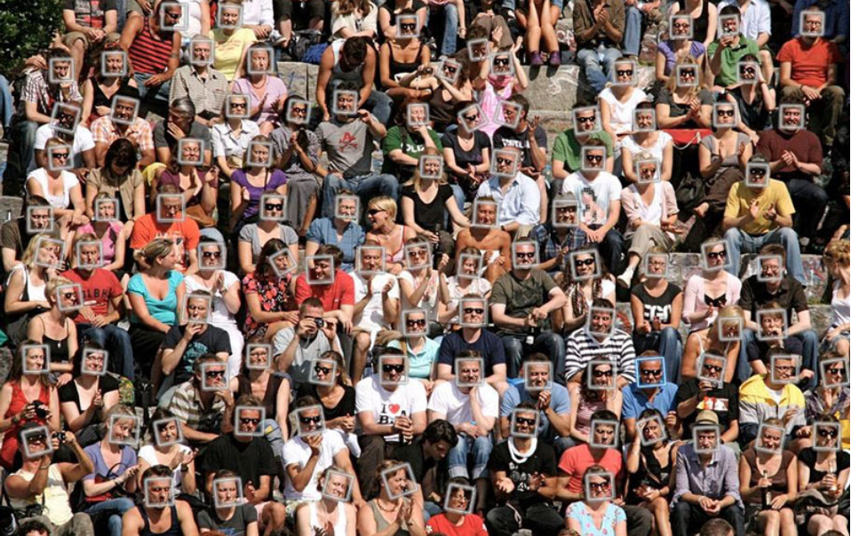
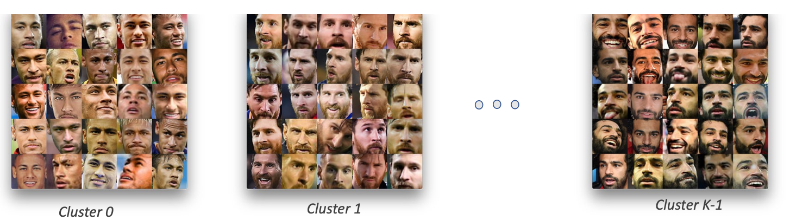

# Face-Detection---Clustering-Imperative-Code

# University at Buffalo
# Department of Computer Science and Engineering 
# CSE 473/573 - Computer Vision and Image Processing

Fall 2022

Given a face detection dataset composed of hundreds of images, the goal is to detect faces contained in the images. The detector should be able to locate the faces in any testing image. Figure 2 shows an example of performing face detection. We will use a subset (will be provided) of FDDB [1] as the dataset for this project. You can use any face detection modules available in OpenCV or face recognition.

You will be building on top of the above face detection code to do face clustering. You will be using images present in faceCluster K folder for part B (i.e., face clustering). Each image will only contain one face in it. K in faceCluster K folder name provides you the unique number of face clusters present.
 You have to implement clustering algorithm by yourself. You may not use OpenCV APIs that have ‘face’, ‘kmeans’, ‘knn’ or ‘cluster’ in their name or any other libraries which have implement the clustering algorithm for you.

